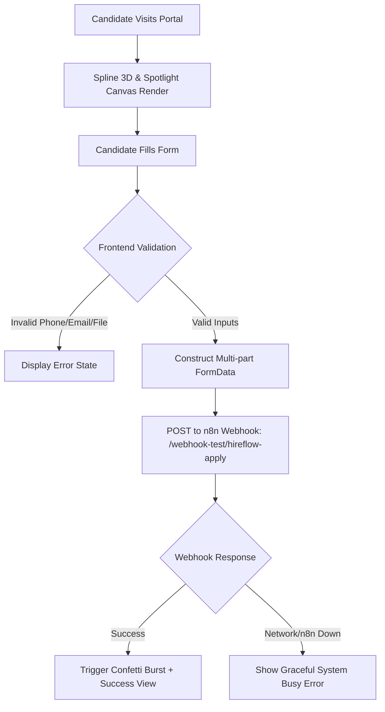

# HIREFLOW ATS - Complete Project Specification & State Index (`build.md`)

> **Single Source of Truth (SSOT)** for AI Agents and Developers.  
> *Last Updated: March 2026* | *Engine: Next.js 16.1 (Turbopack) & React 19*

---

## 1. Executive Summary & Core Mission
**HIREFLOW** is a state-of-the-art AI-Powered Candidate Intake Portal and Applicant Tracking System (ATS) frontend designed for high-conversion candidate submissions. It integrates:
- **Interactive 3D Visuals:** Spline 3D real-time canvas backdrop for an immersive experience.
- **Glassmorphic UI:** Modern dark-mode interface built with Tailwind CSS v4, custom Spotlight lighting, and micro-interactions.
- **Strict Multi-Country Validation:** Specialized phone input supporting top Asian and European employment markets with automatic digit constraint enforcement.
- **Dual-Mode Resume Ingestion:** Drag-and-drop & native file picker supporting PDF documents (up to 5MB) and OCR-ready images (PNG/JPG up to 1MB).
- **Automated AI Pipeline Integration:** Seamless `FormData` dispatch to local/remote n8n webhook pipelines triggering Google Gemini extraction and Groq LPU scoring.

---

## 2. Architecture & Data Flow



### Component Responsibility Breakdown
```
HIREFLOW Root
│
├── app/
│   ├── layout.tsx        -> Root HTML shell, Geist Sans/Mono font injection, global metadata
│   ├── globals.css       -> Tailwind CSS v4 import, custom @theme tokens, dark mode root vars
│   └── page.tsx          -> CandidatePortal: Main client component handling form state, validation, 3D scene & webhook submission
│
├── components/
│   └── ui/
│       ├── card.tsx      -> Glassmorphic Card, CardHeader, CardContent container wrappers
│       ├── spline.tsx    -> Lazy-loaded SplineScene with Suspense boundary
│       └── spotlight.tsx -> High-performance SVG blur spotlight backdrop
│
├── lib/
│   ├── types.ts          -> Strong TypeScript contracts for CountryConfig, FormState, Webhook payloads
│   └── utils.ts          -> Utility helpers (cn class merging)
│
├── directives/           -> SOPs and operational guidelines for AI agents
├── execution/            -> Deterministic scripts and execution tools
└── next.config.ts        -> Turbopack workspace root resolution & Next.js config
```

---

## 3. Tech Stack Matrix

| Technology | Version | Purpose |
| :--- | :--- | :--- |
| **Next.js** | `16.1.1` (Turbopack) | App Router, Server/Client components, SSR & SSG |
| **React** | `19.2.3` | Core UI engine, React 19 concurrent features |
| **TypeScript** | `5.x` | Strict type safety and schema validation |
| **Tailwind CSS** | `4.x` | Modern styling engine with native `@theme` directives |
| **@splinetool/react-spline** | `4.1.0` | Interactive 3D robot/space scene integration |
| **@splinetool/runtime** | `1.12.28` | WebGL runtime for Spline scenes |
| **canvas-confetti** | `1.9.4` | Particle celebration physics upon application receipt |
| **clsx & tailwind-merge** | `2.1.1` / `3.4.0` | Conflict-free conditional CSS utility concatenation |

---

## 4. Input Validation & Country Constraints Matrix

The portal implements strict localized phone length validation for 10 target countries (Top 5 Asian + Top 5 European tech hubs):

### Asian Markets
| Country | Code | Label | Max Length | Placeholder Format |
| :--- | :--- | :--- | :--- | :--- |
| **India** | `+91` | `IN (+91)` | 10 digits | `98765 43210` |
| **China** | `+86` | `CN (+86)` | 11 digits | `139 1234 5678` |
| **Japan** | `+81` | `JP (+81)` | 10 digits | `90 1234 5678` |
| **Singapore** | `+65` | `SG (+65)` | 8 digits | `8123 4567` |
| **UAE** | `+971` | `UAE (+971)` | 9 digits | `50 123 4567` |

### European Markets
| Country | Code | Label | Max Length | Placeholder Format |
| :--- | :--- | :--- | :--- | :--- |
| **United Kingdom** | `+44` | `UK (+44)` | 10 digits | `7700 900077` |
| **Germany** | `+49` | `DE (+49)` | 11 digits | `151 23456789` |
| **Spain** | `+34` | `ES (+34)` | 9 digits | `612 345 678` |
| **Italy** | `+39` | `IT (+39)` | 10 digits | `312 345 6789` |
| **Netherlands** | `+31` | `NL (+31)` | 9 digits | `6 12345678` |

### File Upload Constraints
- **PDF Resumes:** Max allowed size is **5,000,000 bytes (5MB)**. MIME: `application/pdf`.
- **Image Resumes (OCR):** Max allowed size is **1,000,000 bytes (1MB)**. MIME: `image/jpeg`, `image/png`.
- **Validation Reaction:** Immediate client-side error toast with human-readable size reporting (e.g. `PDF too large (6.20MB)! Max size is 5MB.`).

---

## 5. Backend & Webhook Integration Contract

- **Endpoint URL:** `http://localhost:5678/webhook-test/hireflow-apply` (configurable for production)
- **Method:** `POST`
- **Body Format:** `multipart/form-data`
- **Fields:**
  - `name`: Candidate full name (String)
  - `phone`: Country code + number (String, e.g. `+91 9876543210`)
  - `email`: Validated email address (String)
  - `resume`: Binary file stream (`File` object)

---

## 6. Ponytail Lean Engineering & Optimization Log
Based on the Ponytail audit, the following lean architecture principles are enforced:
1. **Zero Dead Dependencies:** Removed unused `framer-motion` package, cutting down bundle weight and build overhead.
2. **Regex Simplification:** Removed redundant `\b` inside character classes (`/^[0-9]+$/`) and streamlined email checks.
3. **No Speculative Abstractions:** Kept single-purpose helper components straightforward without multi-layer boilerplate.
4. **Clean Next.js 16 Config:** Configured workspace root resolution to avoid Turbopack multi-lockfile ambiguity.
5. **Proper Font Cascading:** Ensured Geist sans/mono fonts properly map to body typography via CSS variable bindings.

---

## 7. AI Agent Operating Guidelines

When entering this repository for future tasks:
1. **Read `build.md` first:** Contains the latest map of the application, eliminating the need to search every file.
2. **Preserve Validation Invariants:** Do not weaken the 10-country phone length restrictions or file size limits without explicit request.
3. **Maintain Visual Fidelity:** Spline 3D canvas and glassmorphic card depth are core design signatures of HireFlow.
4. **Verify Build:** Always run `npm run build` or `npm run lint` before completing turns.
