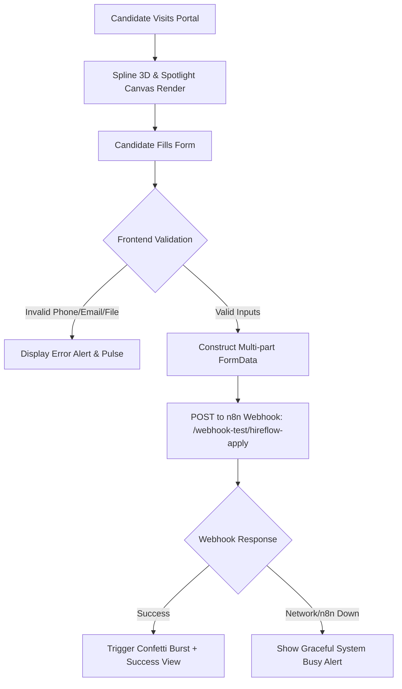

# HIREFLOW ATS - Complete Project Specification & State Index (`build.md`)

> **Single Source of Truth (SSOT)** for AI Agents and Developers.  
> *Engine: Next.js 16.1.1 (Turbopack) & React 19.2 | Type System: TypeScript 5.x*

---

## 1. Executive Summary & Core Mission
**HIREFLOW** is a state-of-the-art AI-Powered Candidate Intake Portal and Applicant Tracking System (ATS) frontend designed for high-conversion candidate submissions. It integrates:
- **Interactive 3D Visuals:** Spline 3D real-time canvas backdrop for an immersive experience.
- **Glassmorphic UI:** Modern dark-mode interface built with Tailwind CSS v4, custom Spotlight lighting, and micro-interactions.
- **Strict Multi-Country Validation:** Specialized phone input supporting top Asian and European employment markets with automatic digit constraint enforcement.
- **Dual-Mode Resume Ingestion:** Drag-and-drop & native file picker supporting PDF documents (up to 5MB) and OCR-ready images (PNG/JPG up to 1MB).
- **Automated AI Pipeline Integration:** Seamless `FormData` dispatch to local/remote n8n webhook pipelines triggering Google Gemini extraction and Groq LPU scoring.

---

## 2. Architecture & 3-Layer System Design



### Complete Repository Map & Responsibilities
```
HIREFLOW Root
│
├── app/
│   ├── layout.tsx                     -> Root HTML shell, Geist font variables, ATS metadata & SEO tags
│   ├── globals.css                    -> Tailwind CSS v4 import, custom @theme tokens, font cascade
│   └── page.tsx                       -> CandidatePortal: Main client component with validation & 3D scene
│
├── components/
│   └── ui/
│       ├── card.tsx                   -> Glassmorphic Card, CardHeader, CardContent container wrappers
│       ├── spline.tsx                 -> Lazy-loaded SplineScene with Suspense boundary
│       └── spotlight.tsx              -> High-performance SVG blur spotlight backdrop
│
├── lib/
│   ├── types.ts                       -> Strong TypeScript contracts for CountryConfig, FormState, Webhooks
│   └── utils.ts                       -> Utility helpers (cn class merging with clsx + twMerge)
│
├── directives/                        -> Layer 1: SOPs & Operational Directives for AI Agents
│   ├── candidate_intake.md            -> Intake rules, boundary constraints, and error toast behaviors
│   ├── n8n_webhook_integration.md     -> Webhook contract, downstream AI parser, and retry strategies
│   └── spline_3d_assets.md            -> Spline WebGL canvas runtime, positioning & fallback guidelines
│
├── execution/                         -> Layer 3: Deterministic Execution Scripts
│   └── validate_inputs.ts             -> Self-testing validation engine verifying phone, email, file limits
│
├── .env.example                       -> Environment variable schema template
├── next.config.ts                     -> Turbopack workspace root resolution & Next.js config
├── tsconfig.json                      -> TypeScript paths (@/*) and compilation settings
└── eslint.config.mjs                  -> Next.js 16 core web vitals and TypeScript lint configuration
```

---

## 3. Tech Stack & Dependency Matrix

| Technology | Version | Purpose |
| :--- | :--- | :--- |
| **Next.js** | `16.1.1` (Turbopack) | App Router, Server/Client components, SSR & SSG |
| **React** | `19.2.3` | Core UI engine, React 19 concurrent features |
| **TypeScript** | `5.x` | Strict type safety and schema validation |
| **Tailwind CSS** | `4.x` | Modern styling engine with native `@theme` directives |
| **@splinetool/react-spline** | `4.1.0` | Interactive 3D robot/space scene integration |
| **@splinetool/runtime** | `1.12.28` | WebGL runtime for Spline scenes |
| **canvas-confetti** | `1.9.4` | Particle celebration physics upon application receipt |
| **clsx & tailwind-merge** | `2.1.1` / `3.4.0` | Conflict-free conditional CSS utility concatenation |

---

## 4. Input Validation & Country Constraints Matrix

The portal implements strict localized phone length validation for 10 target countries (Top 5 Asian + Top 5 European tech hubs):

### Asian Markets
| Country | Code | Label | Max Length | Placeholder Format |
| :--- | :--- | :--- | :--- | :--- |
| **India** | `+91` | `IN (+91)` | 10 digits | `98765 43210` |
| **China** | `+86` | `CN (+86)` | 11 digits | `139 1234 5678` |
| **Japan** | `+81` | `JP (+81)` | 10 digits | `90 1234 5678` |
| **Singapore** | `+65` | `SG (+65)` | 8 digits | `8123 4567` |
| **UAE** | `+971` | `UAE (+971)` | 9 digits | `50 123 4567` |

### European Markets
| Country | Code | Label | Max Length | Placeholder Format |
| :--- | :--- | :--- | :--- | :--- |
| **United Kingdom** | `+44` | `UK (+44)` | 10 digits | `7700 900077` |
| **Germany** | `+49` | `DE (+49)` | 11 digits | `151 23456789` |
| **Spain** | `+34` | `ES (+34)` | 9 digits | `612 345 678` |
| **Italy** | `+39` | `IT (+39)` | 10 digits | `312 345 6789` |
| **Netherlands** | `+31` | `NL (+31)` | 9 digits | `6 12345678` |

### File Upload Constraints
- **PDF Resumes:** Max allowed size is **5,000,000 bytes (5MB)**. MIME: `application/pdf`.
- **Image Resumes (OCR):** Max allowed size is **1,000,000 bytes (1MB)**. MIME: `image/jpeg`, `image/png`.
- **Validation Feedback:** Immediate client-side error toast with human-readable size reporting and file badge.

---

## 5. Webhook Integration Contract

- **Endpoint URL:** `process.env.NEXT_PUBLIC_N8N_WEBHOOK_URL || "http://localhost:5678/webhook-test/hireflow-apply"`
- **HTTP Method:** `POST`
- **Body Payload (`multipart/form-data`):**
  - `name`: Candidate full name (String)
  - `phone`: Country code + phone number (String, e.g. `+91 9876543210`)
  - `email`: Validated email address (String)
  - `resume`: Binary file payload (`File` object)

---

## 6. Ponytail Lean Engineering & Optimization Log
1. **Zero Dead Dependencies:** Removed unused `framer-motion` package from `package.json`, saving build and bundle overhead.
2. **Regex Simplification:** Cleaned phone regex by removing unused `\b` inside character class (`/^\d*$/`) and streamlined email checks.
3. **Array Lookup Simplification:** Removed redundant `useMemo` from 10-item static country array.
4. **Confetti Overhead Elimination:** Replaced 15-line untyped `setInterval` loop with single particle celebration burst.
5. **SPA Reset Handler:** Added `handleResetForm` on success screen instead of full browser page reload (`window.location.reload()`).
6. **Accessibility Hardening:** Added explicit `htmlFor`, `id`, `name`, `autoComplete`, and `role="alert"` attributes.
7. **Clean Next.js Turbopack Config:** Configured explicit Turbopack root in `next.config.ts` to silence multi-lockfile warnings.
8. **Font Cascade Fix:** Mapped `var(--font-sans)` to `body` in `globals.css` ensuring Geist typography renders properly.

---

## 7. AI Agent Operating Guidelines

When entering this repository for future tasks:
1. **Read `build.md` first:** Contains the complete state and file map of the application.
2. **Preserve Invariants:** Do not alter the 10-country phone validation rules, file limits, or Webhook contracts without explicit instruction.
3. **Maintain Visual Fidelity:** Spline 3D canvas and glassmorphic card depth are core design signatures of HireFlow.
4. **Verify Quality:** Always verify `npm run lint` and `npx tsc --noEmit` before finishing any task.
